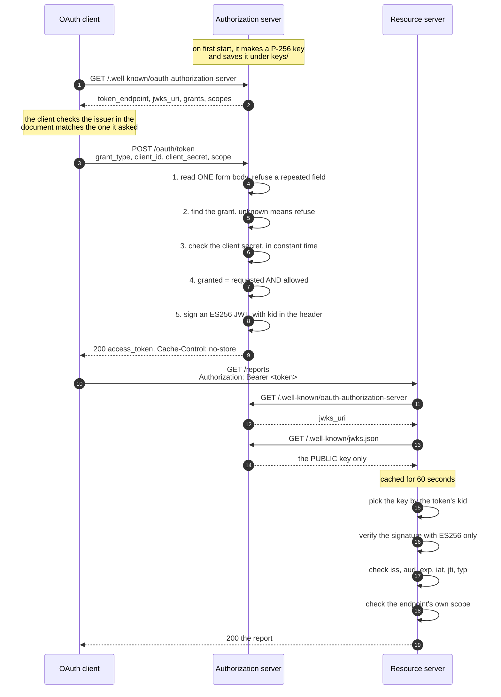
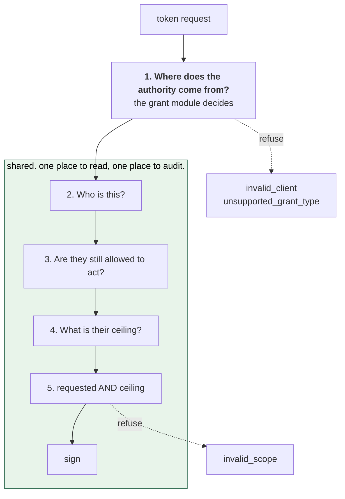

# Architecture

## What this repository is

An OAuth 2.1 authorization server, written from scratch in Python, to learn how
delegated authority survives a chain of AI agents.

A human asks for something. An orchestrator agent picks it up, calls a reporting
agent, which calls a tool agent, which finally touches the data. By then the
human is 3 hops away. The API has to answer one question: **on whose authority
is this happening, and is that authority enough?**

This server is being built to answer that question properly. Today it does the
first part: it can mint a signed token, publish the key to check it, and a
separate server can verify that token without ever calling back.

> Not approved for production use. This is a learning project.

## What works today

| You can do this | Where |
|---|---|
| Ask for an access token as a machine client | `POST /oauth/token` with `grant_type=client_credentials` |
| Find out what the server supports | `GET /.well-known/oauth-authorization-server` |
| Get the public key that checks a token | `GET /.well-known/jwks.json` |

Three programs take part, and each one runs on its own TCP port in the tests:

- **The OAuth client** asks for a token. It reads the metadata first, so it
  never has a hardcoded URL. See `tests/oauth_client/client.py`.
- **The authorization server** signs tokens. It is the only program that holds
  the private key. See `src/`.
- **The resource server** protects an API. It fetches the public key over HTTP
  and checks the token on its own. See `tests/resource_server/`.

The resource server never imports anything from the authorization server's
signing code. That is deliberate. If it did, the tests would prove nothing about
whether a real, separate service could verify a token.

## What does not exist yet

Being honest about this matters more than the list of what works.

- No database. Clients come from environment variables, and issued tokens are
  not recorded anywhere.
- No HTTP Basic client authentication. The specification says a server must
  support it. This one does not yet.
- Client secrets are compared in plain text, not hashed.
- No human in the flow. There is no login page and no consent screen.
- No delegation. No `act` chain, no token exchange.
- No revocation. A token issued by mistake is valid until it expires.
- No key rotation, no rate limiting, no audit trail.

Each gap is a tracked issue. See the [roadmap](roadmap/README.md).

## How one request works, end to end

This is the whole system, from an empty terminal to a protected API returning
data.



Step 3 is where the resource server does something worth noticing. It goes to
the authorization server for the **key**, not for an answer about the token. It
then decides by itself. That is what makes a signed token cheap: the check costs
microseconds and no network call, once the key is cached.

## The code, file by file

### The authorization server

| File | What it does |
|---|---|
| `src/crypto/keys.py` | Makes the P-256 key on first start, saves it, and publishes the public half as a JWK. Also computes the `kid`. |
| `src/api/routes.py` | The 4 HTTP routes. It parses, hands off, and turns the answer into JSON. No rules live here. |
| `src/api/forms.py` | Reads exactly one form body. Refuses a field that appears twice. |
| `src/api/metadata.py` | Builds the discovery document from what is actually installed. |
| `src/auth/` | How a client proves who it is. One file per method. |
| `src/grants/` | Where the authority in a new token comes from. One file per grant. |
| `src/services/pipeline.py` | The shared path every grant runs through, and the only place a token is signed. |
| `src/services/scopes.py` | `parse_scope` and `attenuate`. |
| `src/services/clients.py` | The client record and the lookup. |
| `src/config.py` | Settings read from the environment. |
| `src/main.py` | Builds the app for `uvicorn`. |

### The other two programs

| File | What it does |
|---|---|
| `tests/oauth_client/client.py` | A real HTTP client. Reads metadata, then asks for a token. |
| `tests/resource_server/app.py` | A FastAPI app with a protected `/reports` endpoint. |
| `tests/resource_server/verifier.py` | Fetches the JWKS, caches it, and checks a token. |

## The five steps every grant runs through

`client_credentials` is the only grant today. Three more are coming. They all run
the same steps, and only the first one differs.



Step 1 lives in `src/grants/client_credentials.py`. Steps 2 to 5 live in
`IssuancePipeline.issue` in `src/services/pipeline.py`.

Steps 2, 3 and 4 do almost nothing today, and they are still written as separate
methods. That is on purpose. When clients get a `status` column, the refusal for
a suspended client belongs in step 3, not inside the password check in step 1.
Those are 2 different questions and they have to be able to fail separately.

## What is inside a token

```json
{
  "iss": "http://127.0.0.1:8000",
  "sub": "agent:reporting",
  "aud": "agent-resource",
  "iat": 1789376494,
  "exp": 1789377094,
  "jti": "n6G4XzV4FWPs_VaOrFXi6AsIsJxd5Za2",
  "client_id": "reporting-agent",
  "scope": "reports:read"
}
```

The header carries `alg: ES256`, `typ: at+jwt`, and a `kid`. The `kid` is the
RFC 7638 thumbprint of the public key, so it is the same after a restart.

## Rules the code holds

These are the things that are true today and must stay true. Each one is a test.

- **The private key never leaves the authorization server.** The JWKS response
  carries no `d` member. The key file is mode 600 and its folder is 700.
- **A caller cannot choose how its token is verified.** The resource server has
  a fixed `ES256` allow-list. A token header can pick a `kid`; it cannot pick
  the algorithm. An HS256 token forged from the published public key is refused.
- **Only the form body is read.** A query parameter never reaches a grant, and a
  field that appears twice is refused. A caller cannot send 2 values and hope
  the server reads the wrong one.
- **An empty scope list means no authority, never all authority.** A client
  registered with zero scopes cannot get any.
- **Scopes only ever shrink.** `granted = requested AND allowed`. There is no
  input that produces more.
- **An unknown client and a wrong secret look the same.** Same status, same body,
  and the same amount of work, so the response time cannot be used to find out
  which client IDs are real.
- **Token responses are never cached.** `Cache-Control: no-store` on every
  success and every refusal.
- **The server advertises only what it implements.** The discovery document is
  built from the installed grants and auth methods, so it cannot claim something
  the code cannot do. A test asserts the 2 lists match.

## Where to read next

- [Design notes](design.md) for the endpoint contracts and the reasons behind
  each decision.
- [Roadmap](roadmap/README.md) for the 6 phases and what each one adds.
- The [issue tracker](https://github.com/Kunal-5402/agent-oauth-from-scratch/issues)
  for the work broken into single steps.
